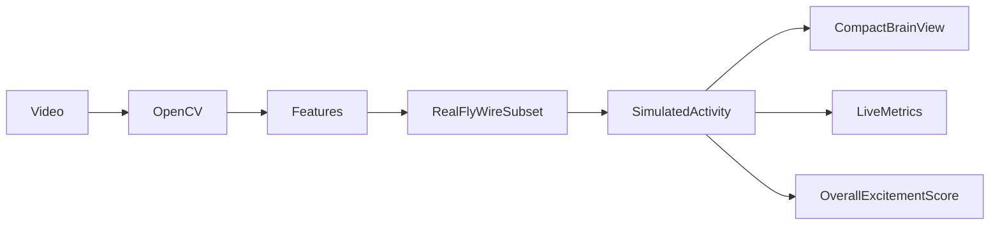
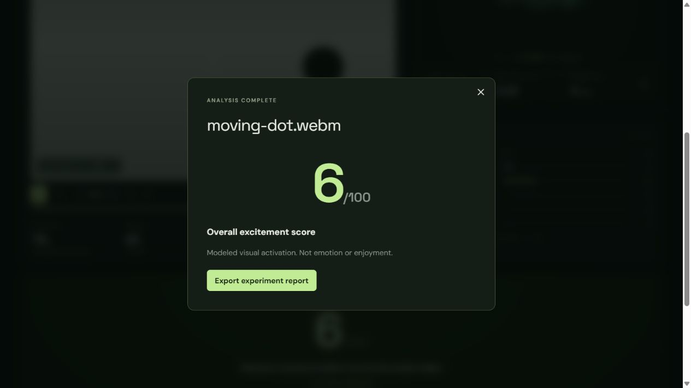

Live playback update: selecting a compatible MP4/WebM starts local playback with background analysis. The **Show fly interpretation** toggle displays model contrast/motion input cues on the same clock. Dopamine high covers sampled playback frames. No video upload/transcoding is required for this flow; the batch API below is optional. Use `npm run build` then `npm start` for a faster production preview.

Current result: **Dopamine high** is the peak reference-normalized dopamine response index. Raw modeled activity is retained in exports. The scale uses six fixed visual feature references; it is not a biological dopamine measurement. The brain uses smooth anatomical neuropil surfaces.

# FlyVision - Connectome Lab

Real FlyWire v783 connectivity, custom video analysis, compact interactive brain view, and one overall excitement score. **The score summarizes modeled visual activation, not emotion or enjoyment.**

## Run everything

Node.js 22 and Python 3.12 are required. In PowerShell:

```powershell
npm install
python -m venv .venv
.\.venv\Scripts\python.exe -m pip install -r backend/requirements.txt
npm run dev:all
```

Open http://127.0.0.1:3000. The API runs at http://127.0.0.1:8000/docs. To run separately use `npm run dev` and `.\.venv\Scripts\python.exe -m uvicorn backend.main:app --host 127.0.0.1 --port 8000`.

## Upload your video

Choose **Upload video**, then a compatible MP4 or WebM up to 100 MB. It plays locally while a browser worker computes live activity. Toggle **Show fly interpretation** to inspect the same video’s modeled input cues. Dopamine high records the highest sampled response.

Videos stay local. The separate batch API uses OpenCV and can create previews in ignored `data/uploads/`; the default browser flow does not upload or transcode.

## Real data, already configured

The tracked `data/processed/visual_subgraph.json` contains **18,940 real neurons and 326,400 recorded synaptic connections**. It is extracted from 15,091,983 source connections in FlyWire FAFB v783 distributed by the original Shiu research authors, joined with official FlyWire annotations. Real neuron anchor coordinates are used; lines are graph edges, not skeletons. Both services fail explicitly if the real subset is absent. There is no automatic synthetic fallback.

To reproduce the subset (downloads approximately 132 MB if raw files are absent):

```powershell
.\.venv\Scripts\python.exe scripts/prepare_real_connectome.py
.\.venv\Scripts\python.exe scripts/prepare_brain_surfaces.py
npx tsx scripts/calibrate_response.ts
```

Pinned revisions, source URLs, SHA-256 checksums, input population choices and limitations are in [DATA_SOURCES.md](docs/DATA_SOURCES.md) and `data/processed/provenance.json`.

## Score

The live index compares raw mean dopamine-positive activity with a fixed blank baseline and strongest reference response. Dopamine high is its maximum over sampled playback frames. The same graph and settings use the same scale across videos. Exports include raw activity, calibration values, model hash and settings. See [current methodology](docs/METHODOLOGY.md).

Demos and live uploads use the same browser feature extractor. The optional batch API uses OpenCV; compare only within the same extractor and settings.

## Tests and production

```powershell
npm test
.\.venv\Scripts\python.exe -m pytest tests -q
npm run build
npm start
```

Run the backend separately alongside `npm start`. Real-data tests check IDs, provenance, input-cell types, normalization, documented LC4 mapping and actual descending paths. Original import scripts remain available for custom release-matched CSV datasets.



See [methodology](docs/METHODOLOGY.md) and [implementation status](IMPLEMENTATION.md). All activation is computationally simulated; structural connectivity does not measure electrical activity, preference, emotion or consciousness.

## Verified sample upload


