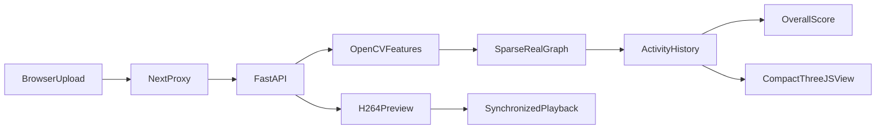

# Architecture

The local Next.js application reads the bundled real graph through `/api/connectome`. Custom uploads go through same-origin `/api/video/analyze` to FastAPI on port 8000. The server decodes, samples, simulates and returns a timestamped activity history plus a private local preview ID. `/api/media/{id}` proxies range requests for seeking. Server-side content stays under `data/uploads` and is not committed.

For immediate controlled demonstrations, browser feature extraction drives the same graph. Captured A/B analyses are compared only within an extractor and parameter configuration. The default route never silently falls back to synthetic connectivity. Configuration: `CONNECTOME_PATH` for the graph path (set consistently for both services), `ANALYSIS_API` for an alternative local API origin.

The graph builder reads pinned Parquet connectivity and official TSV annotations, selects literature-associated visual input populations, traces bounded downstream hops, preserves source positions, and writes optimized JSON plus a provenance manifest. No full connectome is sent to the browser.
